# 一、所需必要工具

1. VMware Workstation（我这里选择的版本是16版本）
2. CentOS 7 镜像文件（这里不提供下载介绍）

# 二、安装CentOS 7虚拟机

## 2.1 创建新的虚拟机的“硬件”
* 点击“创建新的虚拟机”

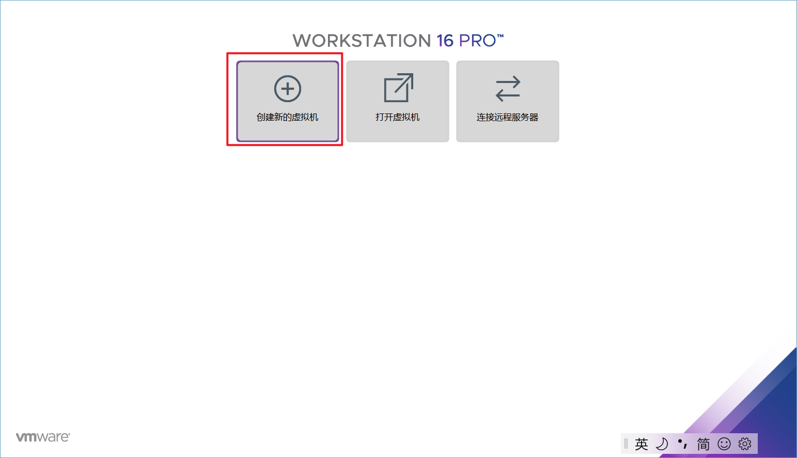

* 选择“自定义（高级）”

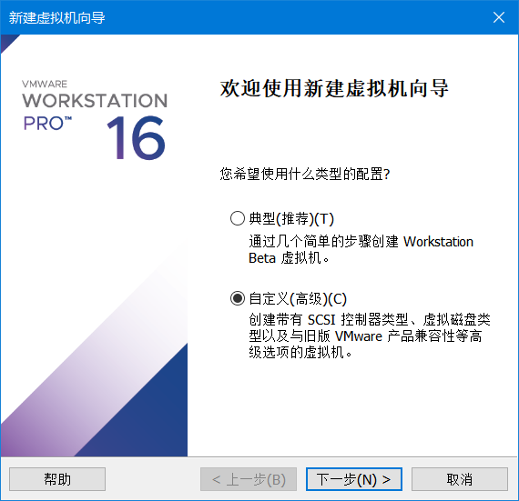

* 兼容，直接默认下一步

* 稍后安装操作系统

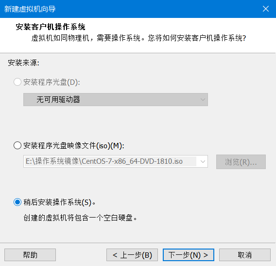

* 选择CentOS 7 64位

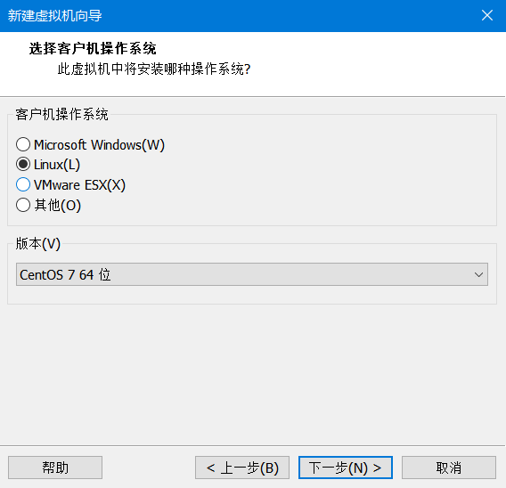

* 选择安装位置

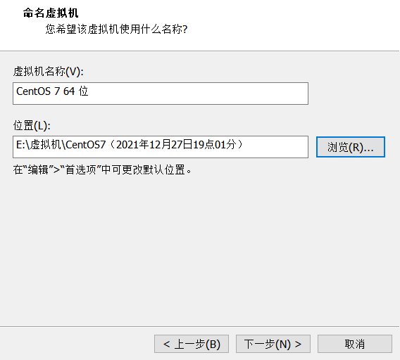

* 选择处理器（我这里选了一颗CPU，两个内核，多少对于这次的教程无所谓）

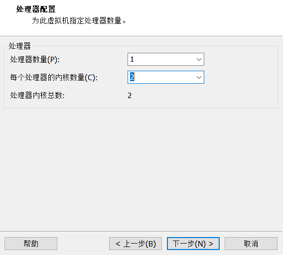

* 选择内存（我这里选了4GB）

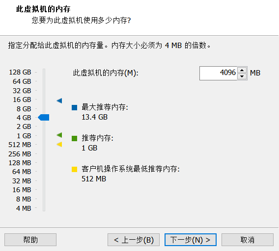

* 选择网络类型（我这里选择了NAT类型）

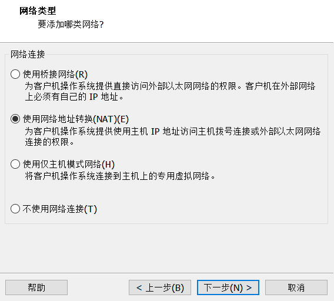

* 选择IO类型

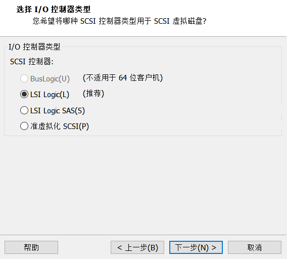

* 选择磁盘类型

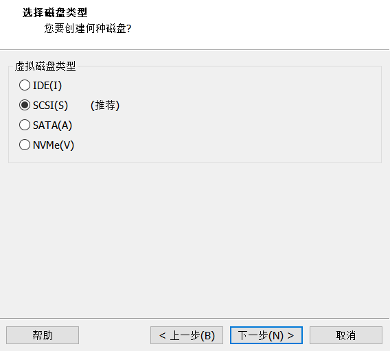

* 创建新虚拟磁盘

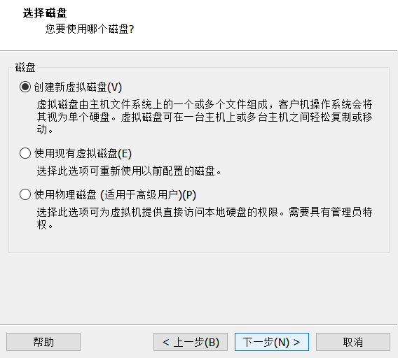

* 指定磁盘容量（这里我创建的是60GB）

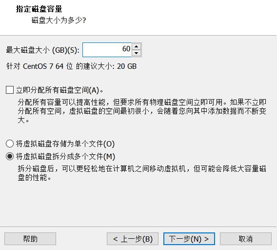

* 磁盘文件名（默认即可）

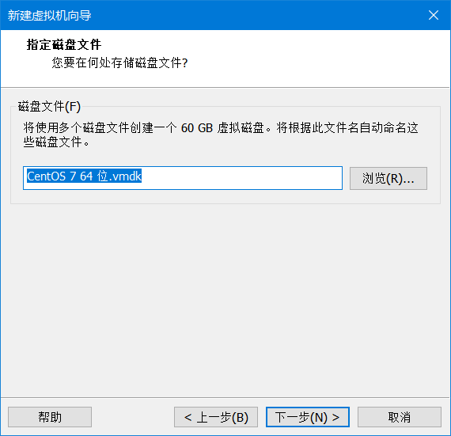

* 完成硬件创建

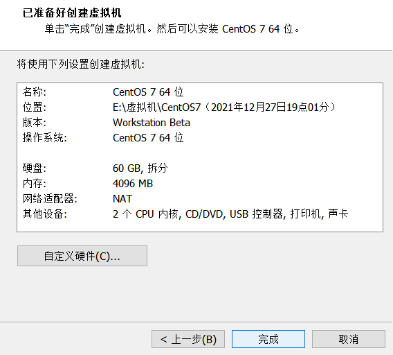

至此硬件创建完成

## 2.2 安装CentOS 7

* 选择dvd来安装CentOS 7

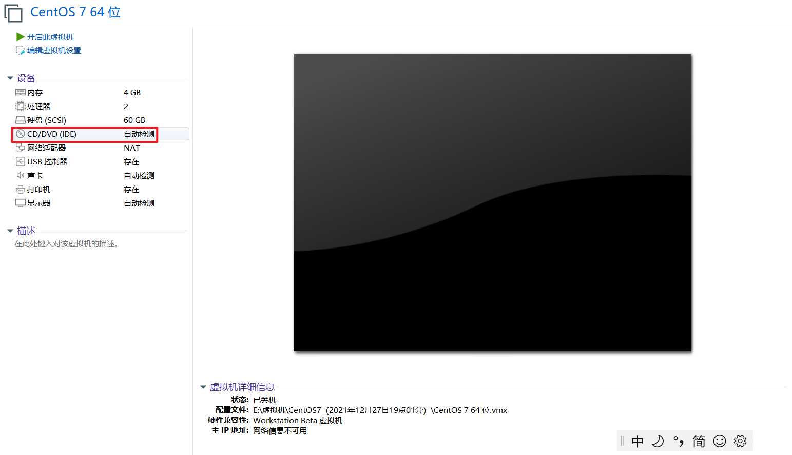

* 选择CentOS7的iso文件

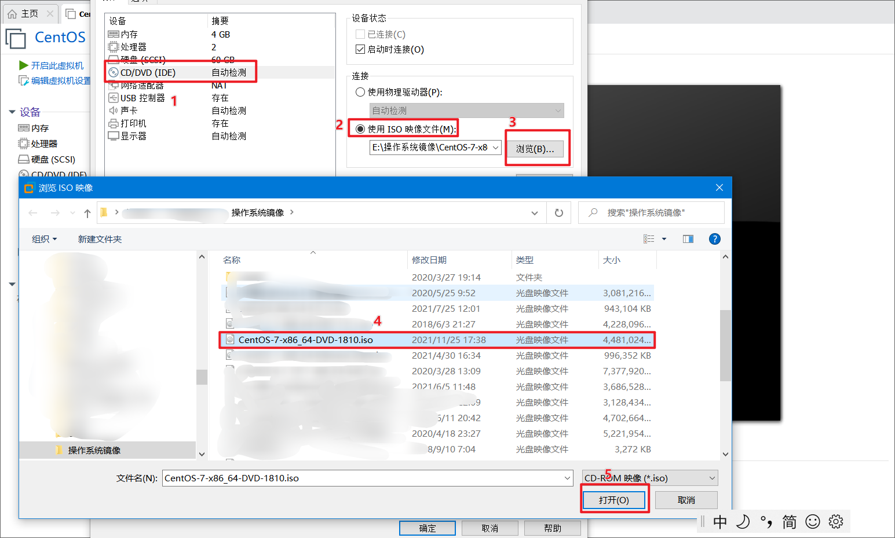

* 后面点击开启此虚拟机（这里就不截图了）

* 选择InstallCentOS7

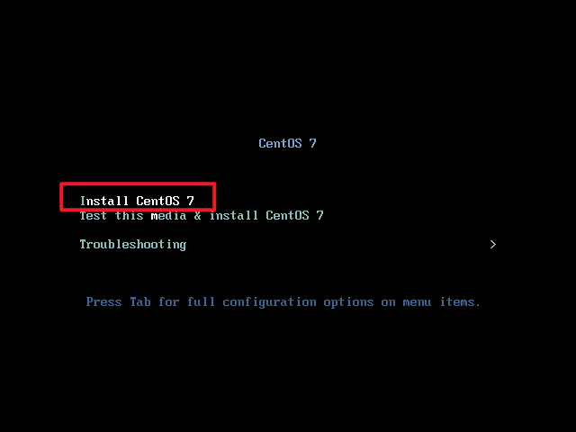

* 语言选择汉语即可（这里就不截图了）

* 安装位置

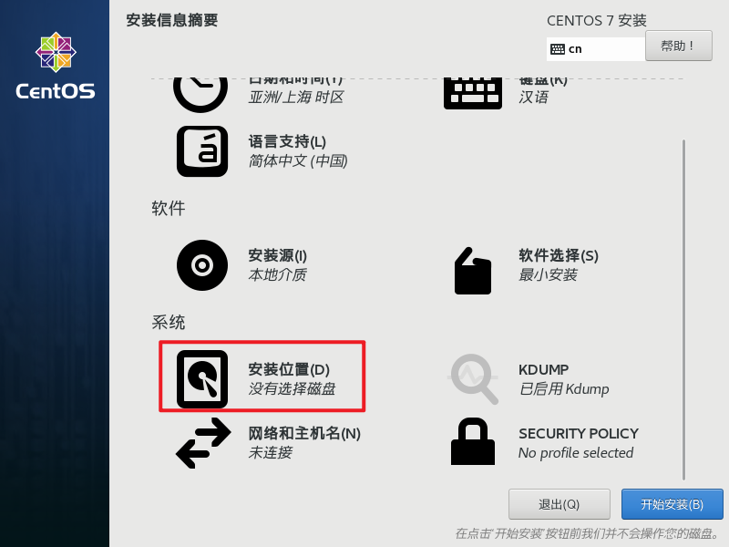

* 选择刚刚的磁盘

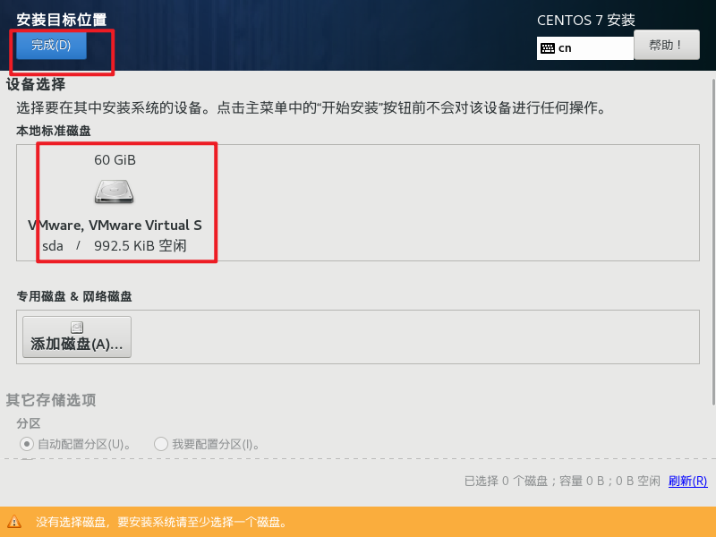

* 软件选择

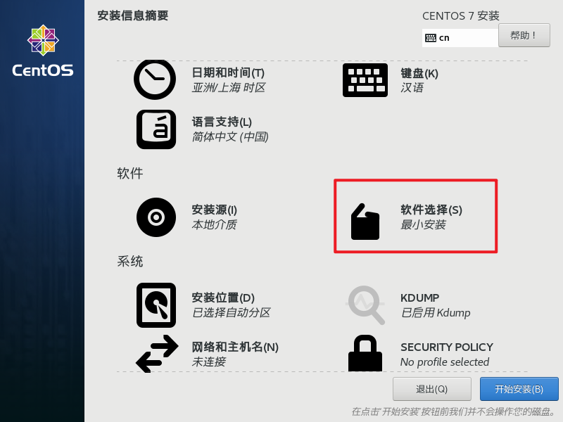

* 选择服务器类型（我这里选择的是带GUI的服务器，因为后面这样方便操作）

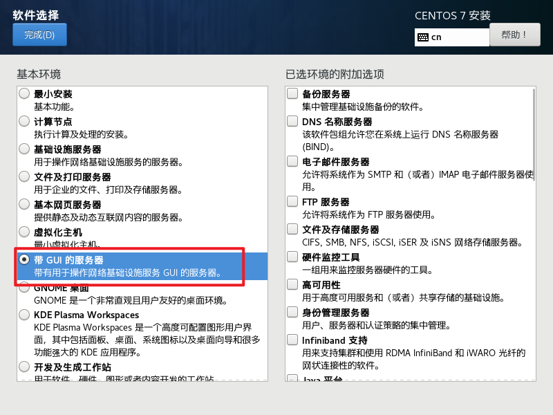

* 选择网络

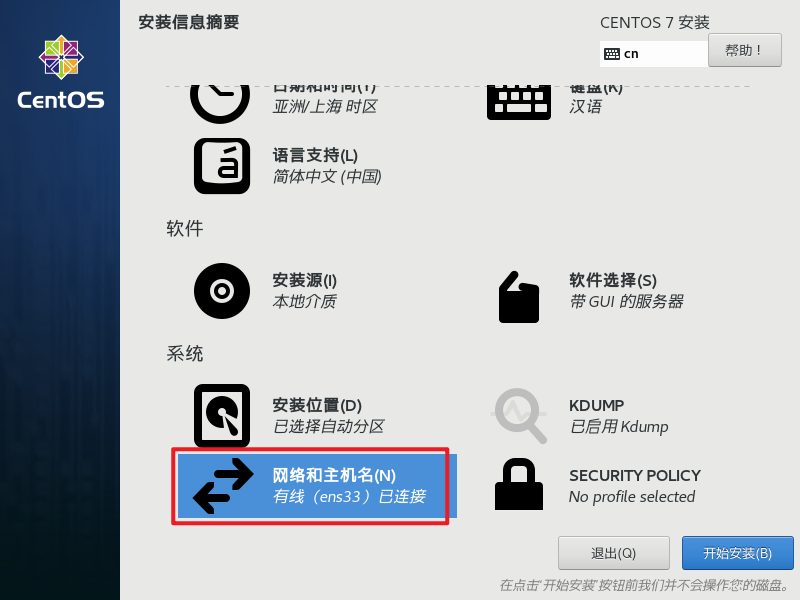

* 打开以太网

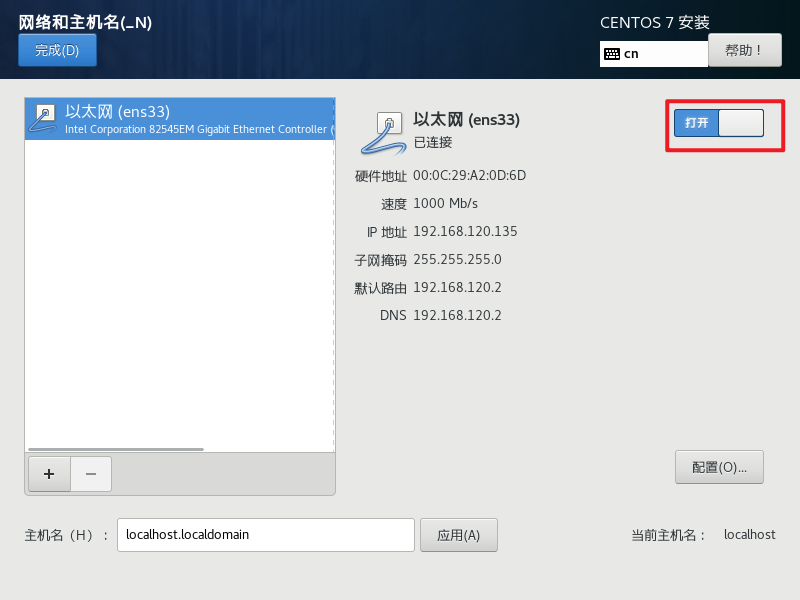

* 点击安装即可（这里就不截图了）

* 设置root密码

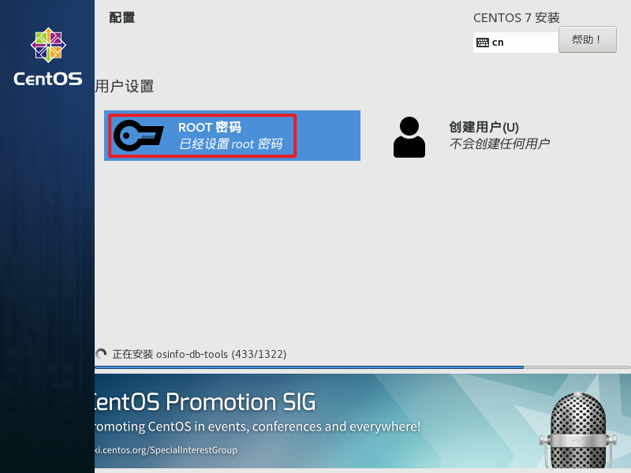

* 后面的密码设置就不截图了。如果密码简单，点击两次完成按钮即可成功

* 可以点击创建用户，因为太简单了这里就不做介绍与截图，同样设置密码太简单不通过点击两次完成按钮即可，如果没有创建用户后面启动后也会创建一个用户，但是就不能设置太简单的密码

等待安装……

* 点击重启即可
* 选中第一个回车即可，或者等待进入即可
* 点击许可证接受（LICENSIN）。如果没有，跳过即可

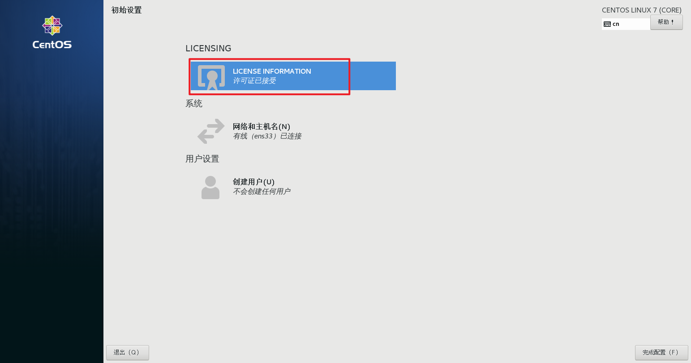

* 授权（带点击我同意后点击完成按钮即可）

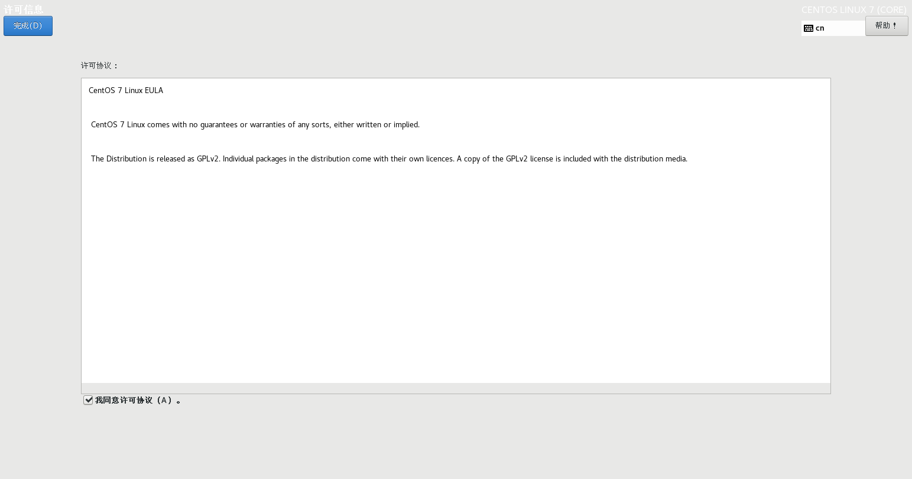

* 然后点击完成配置（这里就不截图了）

* 后面的很简单直接点击下一步即可，如果你前面没有创建用户，后面会让你创建一个用户，直接创建就可以了，只是密码可能需要设置的难一点，一般要包含数字、字母、英文标点符号三种

至此CentOS 7虚拟机安装完成